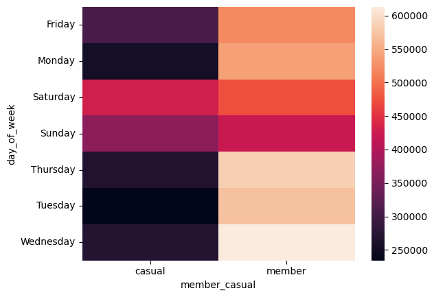
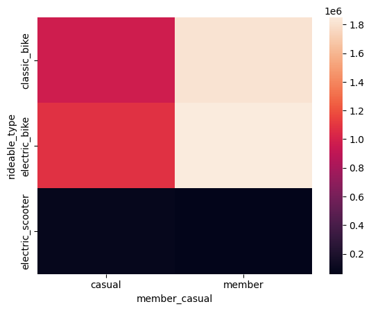
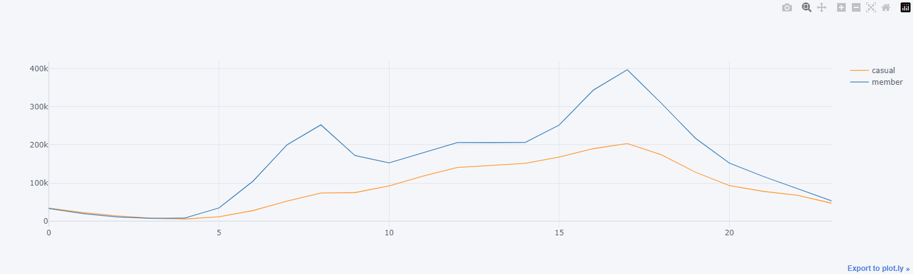
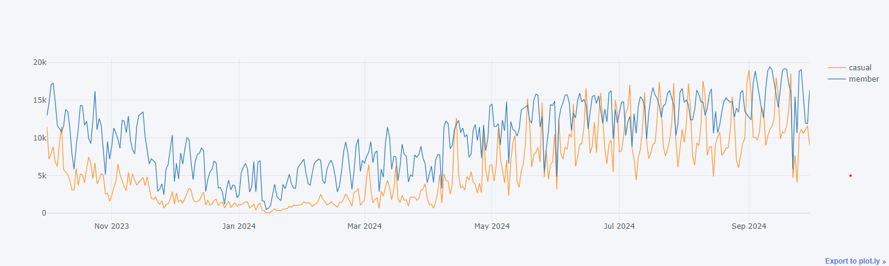

# Introduction
### 🚲 Cyclistic Bike Share User Behavior Analysis 
This project focuses on analyzing usage patterns between casual riders and annual members of Cyclistic bike share, aiming to help the marketing team design strategies for converting casual riders into annual members. By identifying behavioral differences in ride duration, frequency, and timing, we provide actionable insights to encourage membership.
# Background
### The questions this project aims to answer:

1. How do casual riders and annual members differ in terms of ride frequency?
2. What are the average and maximum ride durations for casual riders compared to annual members?
3. How do ride patterns vary by day of the week for each user type?
4. Are there distinct differences in bike type preferences between casual riders and annual members?
5. What are the peak hours and days for bike usage among casual riders and members?
6. How does seasonality impact the bike usage patterns of both casual riders and members?

These questions will guide the analysis, allowing Cyclistic to identify potential opportunities for converting casual riders into committed annual members.
# Tools I Used
The analysis was conducted using **Python** for data cleaning, exploration, preparation, and analysis. Python’s flexibility and powerful libraries make it ideal for handling large datasets and performing comprehensive analyses.
### Key Libraries

- **Pandas**: For data manipulation, cleaning, and transformation, enabling efficient handling of large datasets.
- **Seaborn**: Used for creating informative and visually appealing statistical graphics.
- **Plotly**: Enabled interactive plotting to explore patterns within the data.
- **Cufflinks**: Integrated with Plotly to streamline data visualization and make the plotting process simpler.

# The Analysis
This project’s analysis is split into several sections:

1. **Ride Frequency by User Type**  
   Analyzing the frequency of rides taken by casual riders versus annual members to understand overall usage trends.

2. **Ride Duration Patterns**  
   Calculating average and maximum ride durations for each user type to examine differences in ride behavior.

3. **Weekly Ride Patterns**  
   Segmenting the data by day of the week to observe patterns across weekdays and weekends for each user type.

4. **Bike Type Preferences**  
   Assessing bike type preferences among casual riders and members to identify the most popular bike types.

5. **Daily and Hourly Usage Trends**  
   Exploring daily and hourly ride patterns to pinpoint peak times for bike usage.

6. **Seasonal Impact**  
   Analyzing bike usage across different months to determine how seasonality affects ridership.
# Conclusions
This analysis reveals significant behavioral differences between Cyclistic’s casual riders and annual members, providing valuable insights for targeted marketing strategies:

1. **Ride Frequency by User Type**  
   Annual members are more frequent users than casual riders, making up 63.6% of the total rides. This suggests a consistent reliance on the service, likely for commuting or routine travel.

    | Member Type | Ride Count |
    |-------------|------------|
    | Casual      | 2,130,893  |
    | Member      | 3,723,651  |

2. **Ride Duration Patterns**  
   Casual riders take longer rides on average (25.08 minutes) compared to members (12.49 minutes). This indicates that casual riders may be using the service for leisure or recreational purposes rather than commuting.

    | Member Type | Average Ride Length         |
    |-------------|-----------------------------|
    | Casual      | 0 days 00:25:08.80         |
    | Member      | 0 days 00:12:49.21         |

3. **Weekly Ride Patterns**  
   Casual riders show higher usage on weekends, while annual members ride consistently throughout the week. This suggests that casual riders view the service as a weekend activity, whereas members use it as a regular transportation method.

    

4. **Bike Type Preferences**  
   Both casual riders and annual members prefer classic bikes, with electric bikes as a close second. Understanding these preferences can help in optimizing bike availability for each user type.

    

5. **Daily and Hourly Usage Trends**  
   Peak usage times align with standard commuting hours, particularly around 8 AM and 5 PM. Casual riders also show distinct peaks on weekends, aligning with their tendency for leisure rides.

    

6. **Seasonal Impact**  
   Bike usage increases significantly during the warmer months (June–September) and drops during winter (December–February). This seasonal trend highlights an opportunity to develop seasonal marketing strategies, especially targeting casual riders during warmer seasons.

    

# Closing Thoughts
- This project provided an in-depth look into the behavioral patterns of Cyclistic’s users, distinguishing between casual riders and annual members. By examining usage frequency, ride durations, and preferences, we gained valuable insights that can guide strategic decisions for the Cyclistic marketing team. 

- The findings underscore the importance of understanding user behavior to foster growth, as tailored marketing strategies have the potential to convert casual riders into loyal, annual members. Further exploration of targeted campaigns and seasonal promotions could maximize user engagement and retention. 

- This analysis demonstrates the power of data-driven insights in shaping effective business strategies and highlights how well-executed analytics can transform raw data into actionable outcomes.
